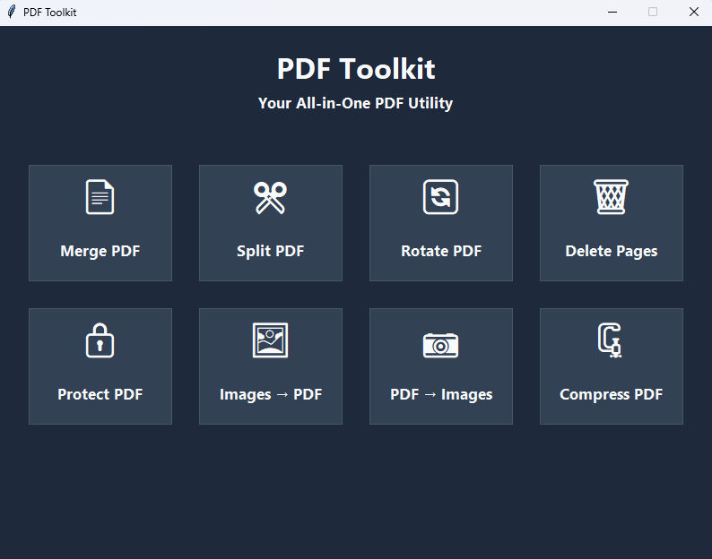

# PDF Toolkit

A desktop application built using **Python** and **Tkinter** that provides a collection of tools for working with PDF files and images through a simple and user-friendly interface.

---

## Screenshot



---

## Features

* Merge multiple PDF files into a single PDF
* Split PDFs into separate documents
* Extract a specific range of pages from a PDF
* Split every page of a PDF into individual files
* Rotate PDF pages
* Delete selected pages from a PDF
* Compress PDF files
* Convert images into a single PDF
* Convert PDF pages into images
* Protect PDF files with password protection
* Input validation and error handling
* Simple and user-friendly Tkinter interface
* File ordering controls for PDF and image operations
* Keyboard shortcuts for common list operations

---

## Technologies Used

* Python 3.13+
* Tkinter
* pypdf
* Pillow
* PyMuPDF

---

## Installation

### 1. Clone the Repository

```bash
git clone https://github.com/s4adx/pdf-toolkit.git

cd pdf-toolkit
```

---

### 2. Create a Virtual Environment

```bash
python -m venv .venv
```

---

### 3. Activate the Virtual Environment

#### Windows PowerShell

```powershell
.venv\Scripts\Activate.ps1
```

#### Windows Command Prompt

```cmd
.venv\Scripts\activate.bat
```

---

### 4. Install Required Packages

```bash
pip install -r requirements.txt
```

---

## Running the Application

Once everything is installed, run:

```bash
python main.py
```

The PDF Toolkit window should open.

Select the required PDF or image operation from the home page and follow the options provided for that tool.

---

## Project Structure

```text
pdf-toolkit/
│
├── backend/
│   ├── compress.py
│   ├── delete.py
│   ├── extract.py
│   ├── images_to_pdf.py
│   ├── merge.py
│   ├── pdf_to_images.py
│   ├── protect.py
│   ├── rotate.py
│   └── split.py
│
├── ui/
│   ├── base_page.py
│   ├── compress_page.py
│   ├── delete_page.py
│   ├── extract_page.py
│   ├── home_page.py
│   ├── images_to_pdf_page.py
│   ├── merge_page.py
│   ├── page_manager.py
│   ├── pdf_to_images_page.py
│   ├── protect_page.py
│   ├── rotate_page.py
│   └── split_page.py
│
├── utils/
│   ├── constants.py
│   ├── file_dialog.py
│   └── helpers.py
│
├── screenshots/
│   └── screenshot.png
│
├── main.py
├── requirements.txt
├── .gitignore
└── README.md
```

---

## Notes

* The application is designed as a lightweight desktop utility for common PDF-related tasks.
* Required Python packages are listed in `requirements.txt`.
* Make sure Python 3.13 or a compatible version is installed before running the application.
* Output files are saved to locations selected by the user through the application.